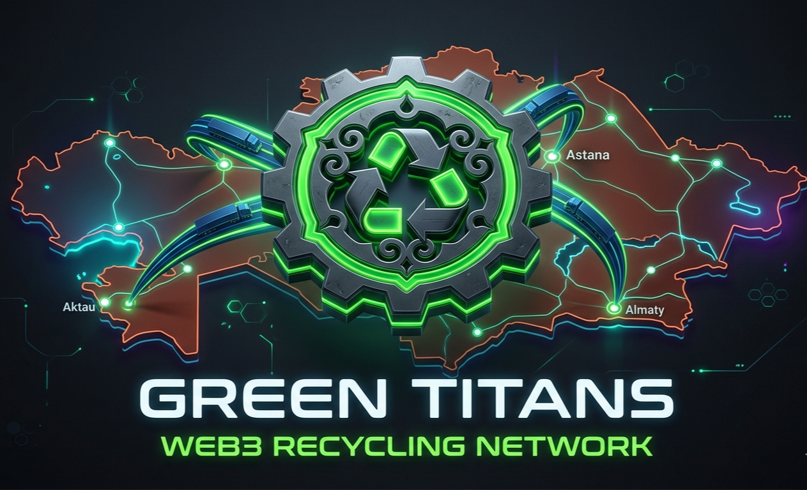
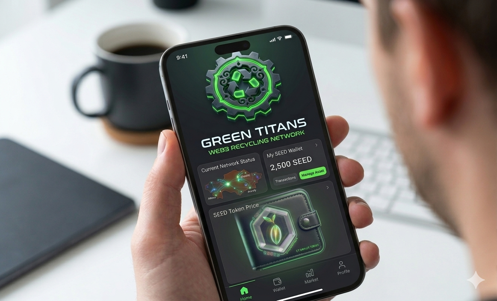

# 🌿 GREEN TITANS: Digital Waste-to-Token Exchange Protocol

  
   
  <b>Цифровая экосистема трансформации отходов в капитал через блокчейн Solana</b>

---

## ⚙️ Цифровой обменник: Механика активов

**Green Titans** — это протокол, который разделяет управление физическими ресурсами и цифровыми обязательствами. Мы создаем прозрачную систему, где каждый участник получает свою выгоду.

### Роли и вознаграждения:
1.  **ЛЮДИ (Поставщики):** Сдают отсортированные отходы и через мобильное приложение получают мгновенное вознаграждение в токенах. Это позволяет гражданам формировать личный капитал за счет экологического вклада.
2.  **БИЗНЕС:** Получает чистое сырье для своего производства, а также становится участником системы сдачи промышленных отходов в обмен на токены, участвуя в цифровой экономике.
3.  **ГОСУДАРСТВО:** Выступает гарантом системы. **Токен обеспечивается исключительно государством через контракт ГЧП**, что делает его стабильным и легитимным цифровым активом.
4.  **БЛОКЧЕЙН (Solana):** Технический фундамент, исключающий подделку данных и гарантирующий прозрачность каждой транзакции.

---

## 📱 Цифровой инструментарий / Digital Assets

  
  

* **Mobile App:** Инструмент пользователя для учета сданных ресурсов и управления токенами.
* **Token:** Ликвидный актив, обеспеченный обязательствами государства в рамках контракта ГЧП.

---

## 🏛️ Стратегические модули проекта

* **[💼 Business Economy](./BUSINESS_MODEL.md)** — Оптимизация производственных циклов.
* **[👥 Capital for People](./PEOPLE_IMPACT.md)** — Механика формирования благосостояния граждан.
* **[🏛️ Strategic Alliance](./GOVERNMENT_STRATEGY.md)** — Юридическая база: ГЧП и государственные гарантии.
* **[📜 Core Philosophy](./PHILOSOPHY.md)** — Логика архитектуры системы.

---

## 🛠 Технологический стек
* **Solana Network:** Мгновенная фиксация транзакций с минимальными издержками.
* **State Guarantee:** Токен как инструмент государственного регулирования эко-баланса.
* **Industrial Cycle:** Прямая поставка вторичного сырья от поставщика к производителю.

---
**Founder & Architect:** Nadezhda Kazantseva / Надежда Казанцева
**LANDORA Holding** | *Karaganda, Kazakhstan*
