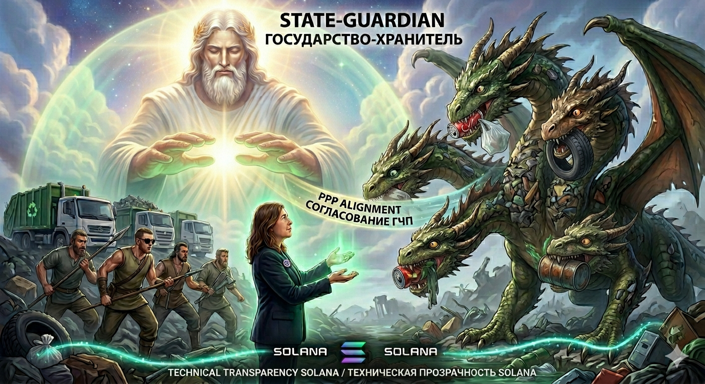

# 🌿 GREEN TITANS: Digital Waste-to-Token Exchange Protocol

  
   
  <b>Цифровая экосистема трансформации отходов в ликвидные активы на базе Solana</b>

---

## ⚙️ How It Works / Механика системы

**Green Titans** — это децентрализованный протокол, который превращает физические отходы в цифровой капитал.

1.  **Supply (Поставщики):** Люди сдают отходы через мобильное приложение.
2.  **Verification (Верификация):** Технологические узлы фиксируют объем и тип сырья.
3.  **Minting (Эмиссия):** Блокчейн Solana мгновенно генерирует токены, которые поступают на кошелек пользователя.
4.  **Circulation (Оборот):** Токены используются в расчетах с бизнесом и государством, создавая реальную экономическую ценность.

---

## 🏛️ Triple Alliance / Тройственный союз

  

* **PEOPLE (ЛЮДИ):** Поставщики сырья, создающие свой личный капитал из того, что раньше было мусором.
* **BUSINESS (БИЗНЕС):** Получатели дешевого вторичного сырья и энергии, улучшающие ESG-показатели.
* **STATE (ГОСУДАРСТВО):** Хранитель системы, обеспечивающий легитимность, безопасность и возврат земель в оборот.

---

## 📱 Digital Assets / Цифровые активы

  
  

* **App:** Личный кабинет пользователя для мониторинга сданных отходов и баланса токенов.
* **Token:** Цифровой эквивалент ресурса, обеспеченный реальными мощностями переработки.

---

## 📖 Ecosystem Documentation / Документация

* **[🏛️ Strategic Alliance](./GOVERNMENT_STRATEGY.md)** — Модель взаимодействия с государством.
* **[💼 Business Economy](./BUSINESS_MODEL.md)** — Токеномика и выгода для предприятий.
* **[👥 Capital for People](./PEOPLE_IMPACT.md)** — Как люди создают благосостояние через экологию.
* **[📜 Core Philosophy](./PHILOSOPHY.md)** — Глубинная логика Архитектора проекта.

---

## 🛠 Technology / Технологии
* **Blockchain:** Solana (высокая скорость, низкие комиссии).
* **Transparency:** Полная прослеживаемость каждой единицы мусора от сдачи до переработки.
* **Sustainability:** Переход от экономики потребления к экономике создания капитала.

---
**Founder & Architect:** Nadezhda Kazantseva / Надежда Казанцева
**LANDORA Holding** | *Karaganda, Kazakhstan*
